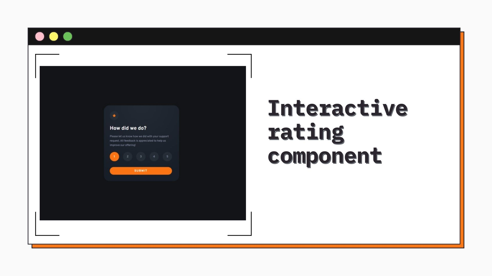
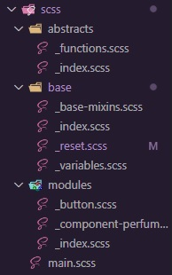

<h1 align="center">Interactive rating component
</h1>

&nbsp;



<h2 align="center"> 
	🚧 Interactive rating component 🟢 Completed 🚀 🚧
  
</h2>

&nbsp;

<!--
## Table of contents

- [Project description](#description) - [What I learned](#What-I-learned) -->

<h2 id="#description">Project description 📚</h2>

This is a solution to the challenge
[Interactive rating component](https://www.frontendmentor.io/challenges/interactive-rating-component-koxpeBUmI).

This is a challenge on the Mentor frontend site, where I was able to put my knowledge of DOM manipulation into practice.

<a href="https://www.frontendmentor.io/challenges?difficulties=4"></a>

&nbsp;

## What I learned

smacss architecture, I treated this project as just one component, so I only used those repositories and partials.



<h3>in this project I put my skills with DOM into practice, it was a simple project, so I didn't have many difficulties.</h3>

<h3>showing selected value in the thank you section, I used the data attribute to make the state change</h3>

```js
const valueNumberCircle = e.target.textContent;
document.querySelector("[data-selected]").textContent = valueNumberCircle;
```

<h3>checking which button is active, and as soon as the user selects the evaluation value the button is released</h3>

```js
circlesAll.forEach((cirChecked) => {
  if (cirChecked.classList.contains(classActive)) {
    // activating the submit button
    blockBtn.classList.add(classActive);
    submitbtn.addEventListener("click", function (e) {
      e.preventDefault();
      howContainer.classList.add(classShow);
      thanksContainer.classList.add(classShow);
    });
  }
});
```

<h3>returning to the home screen with the "ESC" key</h3>

```js
window.addEventListener("keydown", function (e) {
  // short-circuit
  e.key === "Escape" && backFunction();
});
```

## Links

- [Preview Site](https://vinicius-interactive-rating.netlify.app)
<!-- - [Frontend Mentor Solution Page](https://www.frontendmentor.io/solutions/challenge-completed-with-htmlcssleaflet-jsgrid-and-responsive--kw3kKedNp) -->

&nbsp;

## My process

### Built with

- [HTML](https://developer.mozilla.org/en-US/docs/Web/HTML)
- [CSS](https://developer.mozilla.org/en-US/docs/Web/CSS)
- [Vanilla JS](http://vanilla-js.com)

&nbsp;

## 👨‍💻 Author

- [Frontend Mentor](https://www.frontendmentor.io/profile/viniciusshenri96)
- [Linkedin](https://www.linkedin.com/in/vinícius-henrique-7a2533229/)
